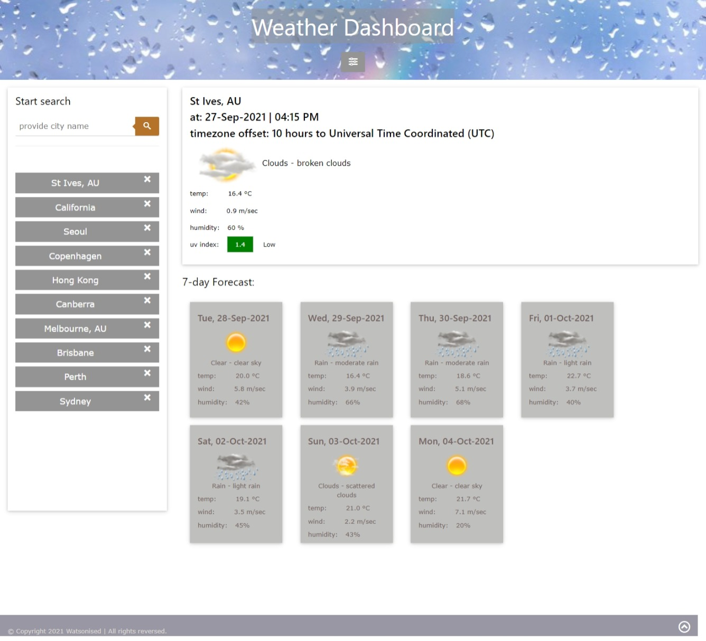
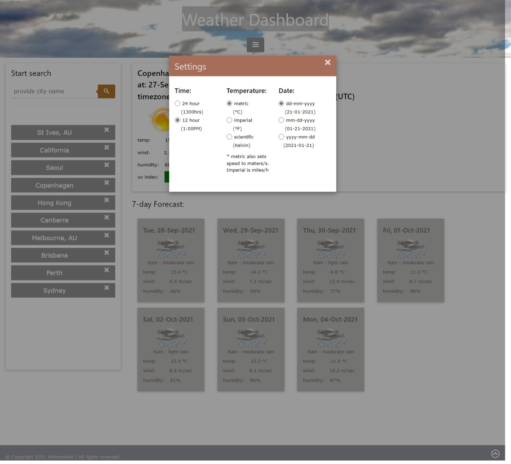

# USYD-FSF Week 6 Project
## Server-side APIs: Weather Dashboard

### Table of Contents  
  
   1. [Project Description](#1-description)
   2. [Application Features](#2-features)
   3. [Installation](#3-installation)
   4. [Usage](#4-usage)
   5. [Credits](#5-credits)
   6. [License](#6-license)
   7. [Repository Status](#7-github-repo-status)
   8. [Contribute](#8-how-to-contribute)
   9. [Tests](#9-tests)
   10. [Checklist](#10-checklist)

---
### 1. Description  
**What is this project?**  
* A weather dashboard that runs in the browser and feature dynamically updated HTML and CSS. Weather data is pulled from the OpenWeather One Call API that has detailed weather data for all cities in the world. 

**Why this project?**  
* Create an application to test my knowledge using JavaScript, API calls and responsive website frameworks.

**What problem does this project solve?**  
* Provides a weather dashboard that a user can search multiple cities around the world.  The cities searched are stored in local memory so they persist after page reload. 

**Lessons learnt?**  
* OpenWeather is an amazing resource.  Thanks to USYD Bootcamp for introducing me to it.  Fascinating amount of weather information from forecasts by the minute through to weekly forecasts.  Amazing resource that I will continue to think of developments that utilises the information.

* I had grand plans for this assignment, most of which I abandoned in the interest of time.  As OpenWeather has so much data I was going to provide the user with the ability to select a forecast card which would open up with a lot more detail - this is a function I will provide at some time in the future.  

* Also planned on having auto correct for the cities database.  There are thousands of cities and I learnt that the system doesn't cope with such a large database - kept on generating errors.  I spent too long trying to learn how to do this with the tools covered so far in the course.  Decided to abandon but another function I'd like to add in the future.

* I started off using Bootstrap for the responsive page setup.  I ended up abandoning it and setting up my own Bootstrap, I grabbed and modified the W3-schools framework to do this.  

---
### 2. Features  
Client requested features as implemented:  
- when a city is searched, the current and future weather conditions for the city is added to the search history;
- when current weather conditions are viewed for that city, the city name, date, icon representing weather conditions, temperature, humidity, wind speed and UV index are all provided; 
- when the UV index is viewed, there is a colour coding that indicates if conditions are favourable, moderate or severe; 
- when I view future weather conditions for that city, I am presented with a 7-day forecast that displays the date, icon repsenting weather conditions, the temperature, wind speed, and the humidity; and
- clicking on a city in search history will present the current and future conditions for that city.

#### The webpage

 
 
---
### 3. Installation  
You can download the source code from [my Github repository](https://github.com/Mark33Mark/weather-dashboard) and open the index.html file to review the website inside your selected web browser.  
Alternatively, the webpage has also been hosted via [URL: task.watsonised.com](https://sun.watsonised.com)

---
### 4. Usage  
The code is available from [my Github repository](https://github.com/Mark33Mark/weather-dashboard) with all assets created for the project.  
Once you've downloaded, you can modify the code as you need.

---
### 5. Credits  
Thanks again W3-schools.  Their responsive CSS framework is excellent and I have used it heavily in making it creating my own framework.  My framework needs a lot of work to not need so many inline style commands in the HTML.

---
### 6. License  
 The works in this repository are subject to:  

---
### 7. Github repo status  

---
### 8. How to Contribute
 If you would like to contribute, please comply with the Contributor Covenant Code of Conduct:  

---
### 9. Tests  
- Tested on a desktop computer, Samsung Note 10+ and laptop computer. Also reviewed the app in the browser's developer tool's mobile phone emulator.  As far as I observed, the app is responsive and functioning well across all devices. 

---
### 10. Checklist  
 All actions not checked are still to be completed:
  * [x]  As a traveler, I can see the weather outlook for multiple cities to plan my trip accordingly.
  * [x]  When the weather dashboard is opened, I can input a city name and am presented with current and future weather conditions for that city and the city is added to the search history.
  * [x]  When I view current weather conditions for the city I am presented with the city name, the date, an icon representing the weather conditions, the temperature, humidity, wind speed and UV index.
  * [x]  When the UV index isi viewed, there is a colour code that indicated if UV conditions are favourable, moderat or severe.
  * [x]  When I view future weather conditions for that city, I am presented with a 7-day forecast that displays the date, icon repsenting weather conditions, the temperature, wind speed, and the humidity.
  * [x]  Clicking on a city in the search history presents me with the current and future weather conditions for that city.
  * [x]  Uses OpenWeather API to retrieve weather data and localStorage to store persistent data.
  * [x]  The application user experience is intuitive and easy to navigate.  The user interface style is clean and polished.
  * [x]  The application resembles the mock-up functionality provided in the homework instructions.
  * [x]  Deployed at live URL, [website](https://sun.watsonised.com) 
  * [x]  Application loads with no errors when inspected with Chrome DevTools.
  * [x]  Github repository contains application code [Github location](https://github.com/Mark33Mark/weather-dashboard)
  * [x]  Repository has a unique name; follows best practice for file structure; and naming conventions.
  * [x]  Repsository follows best practices for class/id naming conventions, indentation, quality comments, etc.
  * [x]  Repository contains multiple descriptive commit messages.
  * [x]  Repository contains a README file with description, screenshot and link to deployed application.
---

- [Back to the top](#usyd-fsf-week-6-project)